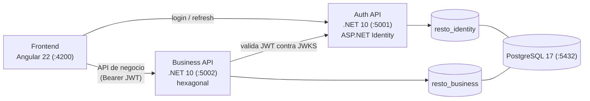

# Arquitectura

## Visión del sistema



- **Frontend** habla con dos APIs: la de Auth (solo para iniciar sesión / renovar
  token) y la de negocio (todo lo demás), adjuntando el JWT como `Bearer`.
- **Auth API** emite JWT firmados con clave asimétrica y publica su clave pública en
  `/.well-known/jwks.json`. Detalle en [`auth.md`](auth.md).
- **Business API** valida el JWT contra ese JWKS; **no** tiene acceso a la base de
  identidad.
- **Un solo contenedor PostgreSQL** con **dos bases separadas**: `resto_identity`
  (usuarios/roles de Identity) y `resto_business` (el dominio de
  `restaurant_schema.sql`).

## Arquitectura hexagonal (ports & adapters)

Cada API .NET es **su propio hexágono independiente**. No se comparte un ensamblado
`Domain` entre Auth y Business.

### Capas y regla de dependencias

```
        ┌───────────────────────────────────────────┐
        │  Api  (adaptador de entrada)              │  controllers/minimal API,
        │  ┌─────────────────────────────────────┐  │  DI, configuración, mapeo DTO
        │  │  Application                        │  │  casos de uso, orquestación,
        │  │  ┌───────────────────────────────┐  │  │  transacciones, puertos usados
        │  │  │  Domain                       │  │  │  entidades, value objects,
        │  │  │  (no depende de nada)         │  │  │  reglas invariantes, PUERTOS
        │  │  └───────────────────────────────┘  │  │
        │  └─────────────────────────────────────┘  │
        │  Infrastructure  (adaptadores de salida)  │  EF Core, repos, JWKS client,
        └───────────────────────────────────────────┘  HTTP, reloj, gateways
```

- **`Domain`**: entidades y value objects del negocio, reglas que siempre deben
  cumplirse, y las **interfaces de los puertos** (`IOrderRepository`,
  `IBranchInventoryRepository`, `IUnitOfWork`, `IClock`, `ITokenIssuer`…). Sin EF
  Core, sin ASP.NET, sin `System.Data`.
- **`Application`**: un **caso de uso por operación de negocio** (p. ej.
  `OpenTableSessionHandler`, `RegisterSaleHandler`). Orquesta puertos, abre la
  transacción, valida reglas que cruzan entidades. Depende solo de `Domain`.
- **`Infrastructure`**: implementaciones concretas de los puertos —
  `DbContext` de EF Core y repositorios, cliente JWKS, adaptadores HTTP, `SystemClock`.
  Depende de `Domain` (y `Application` si expone puertos allí).
- **`Api`**: adaptador de entrada. Controllers / minimal API, validación de request,
  traducción a DTO, composición de dependencias (`Program.cs`), autenticación.
  Es el único proyecto ejecutable.

**Regla:** las flechas de dependencia apuntan **hacia adentro**. `Domain` no
referencia a nadie. Si `Application` necesita algo del mundo exterior, define un
**puerto** en `Domain`/`Application` y deja que `Infrastructure` lo implemente.

### Nomenclatura

| Artefacto | Convención | Ejemplo |
|---|---|---|
| Proyecto | `RestoManager.<Servicio>.<Capa>` | `RestoManager.Business.Application` |
| Puerto de repositorio | `I<Agregado>Repository` | `IReservationRepository` |
| Puerto de servicio externo | `I<Cosa>Gateway` / `I<Cosa>Client` | `IPaymentGateway` |
| Caso de uso | `<Verbo><Concepto>Handler` + `Command`/`Query` | `CloseTableSessionHandler` |
| Adaptador EF | `<Agregado>Repository` (en Infrastructure) | `OrderRepository` |
| Configuración EF | `<Entidad>Configuration` | `OrderConfiguration` |

## Layout del monorepo

```
resto_manager/
├── AGENTS.md
├── docs/
├── requirements/                      # fuente de verdad — NO se modifica
│   ├── restaurant_schema.sql
│   ├── restaurant_schema_specifications.md
│   └── inapp/                         # template de UI de referencia
├── backend/
│   ├── auth/                          # RestoManager.Auth.sln
│   │   └── src/
│   │       ├── RestoManager.Auth.Domain/
│   │       ├── RestoManager.Auth.Application/
│   │       ├── RestoManager.Auth.Infrastructure/
│   │       └── RestoManager.Auth.Api/
│   │   └── tests/
│   └── business/                      # RestoManager.Business.sln
│       └── src/
│           ├── RestoManager.Business.Domain/
│           ├── RestoManager.Business.Application/
│           ├── RestoManager.Business.Infrastructure/
│           └── RestoManager.Business.Api/
│       └── tests/
├── frontend/                          # app Angular 22
└── deploy/                            # docker-compose.yml + Dockerfiles (a futuro)
```

## Topología de despliegue (desarrollo)

Tres contenedores, uno por tecnología (ver [`docker.md`](docker.md)):

| Servicio compose | Imagen base | Puerto | Rol |
|---|---|---|---|
| `postgres` | `postgres:17` | 5432 | Dos bases: `resto_identity`, `resto_business` |
| `backend-auth` | `mcr.microsoft.com/dotnet/sdk:10.0` | 5001 | Auth API (`dotnet watch`) |
| `backend-business` | `mcr.microsoft.com/dotnet/sdk:10.0` | 5002 | Business API (`dotnet watch`) |
| `frontend` | `node:22` | 4200 | `ng serve` |

## Mapa de módulos de dominio

Resumen de `requirements/restaurant_schema_specifications.md` §2. **El spec es la
fuente de verdad**; esto es solo un índice.

| Módulo | Entidades principales | Responsabilidad |
|---|---|---|
| Organización | `restaurants`, `branches`, `departments`, `roles`, `employees`, `shifts`, `employee_leaves` | Estructura de la empresa, sucursales, personal |
| Salón | `tables`, `table_sessions`, `reservations` | Capacidad física, operatividad, ocupación, reservas (la barra **no** es una mesa) |
| Ventas | `orders`, `order_items`, `payments`, `discounts`, `order_discounts` | Cuenta, consumo, cobro, promociones, canal de venta |
| Cliente | `customers`, `reviews`, `gift_cards`, `gift_card_transactions` | Personas identificadas, fidelización, beneficios |
| Menú y cocina | `categories`, `menu_items`, `recipe_items`, `kitchen_stations`, `station_menu_items` | Oferta comercial, recetas, estaciones de preparación |
| Inventario | `ingredients`, `branch_inventory`, `inventory_movements`, `waste_logs` | Catálogo de insumos, balances por sucursal, trazabilidad |
| Compras | `suppliers`, `purchase_orders`, `purchase_order_items` | Abastecimiento de materia prima |
| Delivery | `delivery_drivers`, `deliveries` | Asignación y seguimiento de entregas |
| Impuestos | `tax_rates`, `menu_item_taxes` | Impuestos aplicables a los ítems del menú |

## Invariantes que la aplicación DEBE hacer cumplir

Del spec §10 (`DOM-01…DOM-10`). La BD solo garantiza PK/FK, algunos `CHECK` y la
unicidad de "una sesión abierta por mesa"; **todo lo demás es responsabilidad de la
aplicación** (estrategia sin triggers, spec §9).

| ID | Invariante |
|---|---|
| DOM-01 | `orders.branch_id` = sucursal de la mesa asociada. |
| DOM-02 | Si `orders.table_session_id` está seteado, la sesión pertenece a `orders.table_id`. |
| DOM-03 | No se abre sesión en una mesa `CLEANING` u `OUT_OF_SERVICE`. |
| DOM-04 | `reservations.branch_id` = sucursal de la mesa reservada. |
| DOM-05 | El movimiento de inventario opera sobre el `branch_inventory` de esa misma sucursal e ingrediente. |
| DOM-06 | El empleado que registra la operación está habilitado para esa sucursal. |
| DOM-07 | Idempotencia de stock: una operación de origen → exactamente un movimiento (sin duplicar ni omitir). |
| DOM-08 | `orders.channel = 'DELIVERY'` ⇔ existe fila en `deliveries`. |
| DOM-09 | No se gestiona espacio/ocupación de la barra. |
| DOM-10 | La barra no es reservable (estructuralmente: no hay fila en `tables` que referenciar). |

Reglas complementarias frecuentes:

- **Estados derivados no se persisten.** `tables.operational_status` solo admite
  `ACTIVE` / `CLEANING` / `OUT_OF_SERVICE`; `AVAILABLE` / `RESERVED` / `OCCUPIED` se
  **calculan** (spec §4.2 y Anexo B, `tableDisplayStatus(table, now)`).
- **Consumidor anónimo:** `orders.customer_id` PUEDE ser `NULL`. Nunca se crean
  clientes ficticios tipo `CLIENTE_MESA_1` (`CUS-02`).
- **Canal explícito:** `orders.channel` ∈ `MESA` / `BARRA` / `TAKEAWAY` / `DELIVERY`,
  se guarda tal cual, no se deriva (`ORD-05`, `ORD-06`).
- **Inventario:** sin stock global en `ingredients`; balance vivo en
  `branch_inventory` + ledger firmado en `inventory_movements`; balance y movimiento
  se escriben en **una transacción** (`INV-02…INV-06`).
- **Catálogos de estado** (`orders.status`, `payments.status`,
  `purchase_orders.status`, etc.) son `varchar` libres en la BD; los define la
  aplicación como enums/constantes y se **consultan al usuario** antes de fijarlos.
