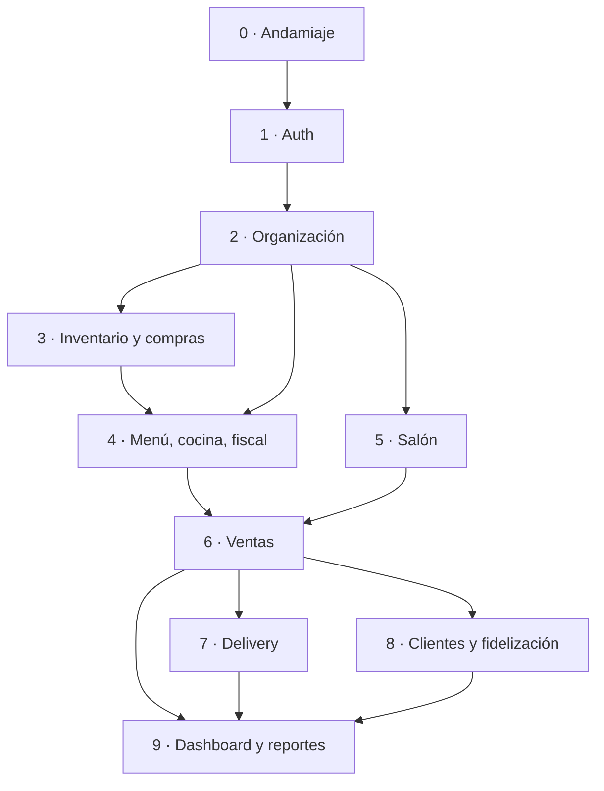

# Roadmap de implementación

Este documento y la carpeta [`roadmap/`](roadmap/) describen **cómo se construye el
sistema, fase a fase**, para que un agente pueda tomar una fase por sesión y
ejecutarla sin ambigüedad.

## Cómo se usa

1. Elige la **primera fase con estado "Pendiente"** cuyas dependencias estén "Hecho".
2. Lee, en este orden:
   - [`roadmap/transversales.md`](roadmap/transversales.md) — reglas que aplican a
     todas las fases (branch scoping, catálogos de estado, transacciones, errores…).
   - `roadmap/fase-XX-*.md` de la fase elegida.
   - El `docs/*.md` de la capa que vas a tocar
     ([`backend.md`](backend.md), [`auth.md`](auth.md), [`frontend.md`](frontend.md),
     [`docker.md`](docker.md)) y [`flujo-de-trabajo.md`](flujo-de-trabajo.md).
   - Las secciones de `requirements/restaurant_schema_specifications.md` que la fase
     referencia.
3. **Resuelve con el usuario las "decisiones bloqueantes" de la fase antes de
   implementar** (cada `fase-XX` las lista al principio).
4. Sigue el flujo de [`git-github.md`](git-github.md): **una fase = una o más
   ramas/PR**. Las fases grandes (2, 3, 6) se parten en varios PR; el `fase-XX`
   indica el corte sugerido.
5. Al terminar, marca la fase como "Hecho" en la tabla de abajo (en su propio PR o en
   el de la fase).

## Estado de las fases

| Fase | Objetivo | Entidades del esquema | Spec | Dependencias | Estado |
|---|---|---|---|---|---|
| [0 — Andamiaje](roadmap/fase-00-andamiaje.md) | Infra Docker + soluciones .NET hexagonales vacías + shell Angular del template | — | — | — | En curso (PR #2) |
| [1 — Auth y usuarios](roadmap/fase-01-auth.md) | Auth API (Identity, JWT asimétrico, JWKS) + validación en Business API + login en el frontend | *(ASP.NET Identity, base `resto_identity`)* | [`auth.md`](auth.md) | 0 | Implementada (PR #3 · #4 · #5, apilados; pendiente de merge) |
| [2 — Organización](roadmap/fase-02-organizacion.md) | Empresa, sucursales y personal; **branch scoping** transversal; selector de sucursal; datos semilla | `restaurants`, `branches`, `departments`, `roles`, `employees`, `shifts`, `employee_leaves` | §2, DOM-06 | 1 | **Hecha** (PR #7, #8, #9). Pendiente futuro: seed real parametrizable y vínculo `AppUser`↔`employees` |
| [3 — Inventario y compras](roadmap/fase-03-inventario-compras.md) | Saldo por sucursal + ledger firmado atómico; proveedores y recepción de compra; mermas | `ingredients`, `branch_inventory`, `inventory_movements`, `waste_logs`, `suppliers`, `purchase_orders`, `purchase_order_items` | §7, §11.4, §11.6, INV-01…08, DOM-05/07 | 2 | **Hecha** (PR #7 backend, #10 frontend). Branch scoping alineado al header `X-Branch-Id` |
| [4 — Menú, recetas, cocina y fiscal](roadmap/fase-04-menu-cocina-fiscal.md) | Carta, recetas (`menu_item` ↔ `ingredient`), estaciones de cocina, impuestos | `categories`, `menu_items`, `recipe_items`, `kitchen_stations`, `station_menu_items`, `tax_rates`, `menu_item_taxes` (+ `menu_item_branch_availability`) | §7.5, §2 | 2, 3 | **Hecha** (PR #11 backend, #12 frontend). Impuestos **inclusivos**; carta global + disponibilidad por sucursal |
| [5 — Salón](roadmap/fase-05-salon.md) | Mesas + sesiones (una abierta por mesa) + estado derivado (Anexo B) + reservas | `tables`, `table_sessions`, `reservations` | §4, §6, §11.1/11.3, SES-*, TBL-*, RSV-*, DOM-03/04 | 2 | En curso — 5a+5b backend hecho (PR #13, `feat/fase-05a-mesas-sesiones`); falta 5c frontend. Ventana `RESERVED` 30/30 min configurable; alta rápida de cliente para reservas (Fase 8 se hace dueña) |
| [6 — Ventas](roadmap/fase-06-ventas.md) | Pedidos con canal explícito, ítems, impuestos, descuentos, pagos múltiples y **descuento de stock por receta** (idempotente + reversa) | `orders`, `order_items`, `payments`, `discounts`, `order_discounts`, `gift_card_transactions` | §5, §7.5, §11.1/2/5/7, ORD-*, DOM-01/02/07, MET-01 | 4, 5 | Pendiente |
| [7 — Delivery](roadmap/fase-07-delivery.md) | Canal `DELIVERY` ⇒ fila en `deliveries` (DOM-08); repartidores; seguimiento | `delivery_drivers`, `deliveries` | §5.4, DOM-08 | 6 | Pendiente |
| [8 — Clientes y fidelización](roadmap/fase-08-clientes-fidelizacion.md) | Clientes, puntos de fidelidad, gift cards (emisión/canje), reseñas | `customers`, `reviews`, `gift_cards`, `gift_card_transactions` | §3, CUS-*, §3.3 | 6 | Pendiente |
| [9 — Dashboard y reportes](roadmap/fase-09-dashboard-reportes.md) | Métricas derivadas de datos transaccionales; dashboard y reportes del template con datos reales | *(solo lectura)* | §8, §12, MET-01/02 | 6, 7, 8 | Pendiente |

## Grafo de dependencias

## Cobertura del esquema

Las 38 tablas de `requirements/restaurant_schema.sql` se reparten así (cada tabla en
**una sola** fase "dueña"; otras fases la consumen):

- **Fase 2:** restaurants, branches, departments, roles, employees, shifts, employee_leaves
- **Fase 3:** ingredients, branch_inventory, inventory_movements, waste_logs, suppliers, purchase_orders, purchase_order_items
- **Fase 4:** categories, menu_items, recipe_items, kitchen_stations, station_menu_items, tax_rates, menu_item_taxes
- **Fase 5:** tables, table_sessions, reservations
- **Fase 6:** orders, order_items, payments, discounts, order_discounts, gift_card_transactions
- **Fase 7:** delivery_drivers, deliveries
- **Fase 8:** customers, reviews, gift_cards, gift_card_transactions *(gift_card_transactions se crea en Fase 6 como medio de pago; Fase 8 añade emisión y saldo de la tarjeta)*

El checklist del spec (§15) queda cubierto por los **criterios de aceptación**
repartidos entre las fases 2–9.
